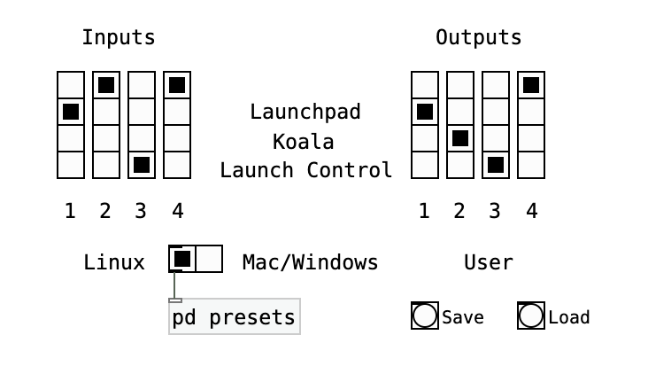
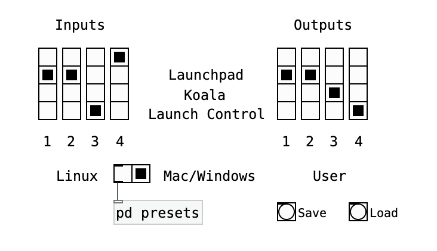
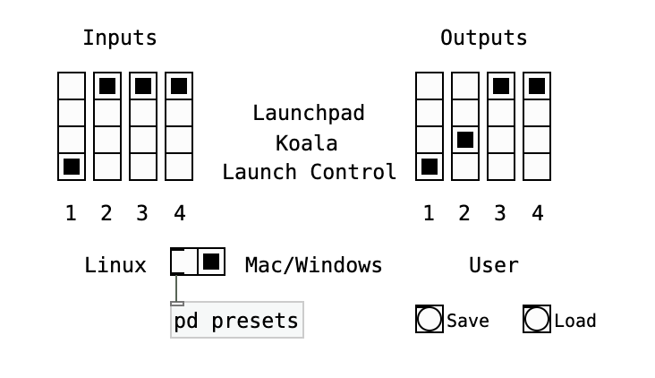

# Koala Sampler patches for Launchpad (et al)

Copyright © 2024 by Albert Gräf \<<aggraef@gmail.com>\>, distributed under the GPL (see COPYING). Please also check my GitHub page at https://agraef.github.io/.

These Pd patches implement control surfaces for Marek Bereza's popular [Koala Sampler](https://www.koalasampler.com/) application. It works similarly to the koala-sampler patch included in the [apcmini](https://github.com/agraef/apcmini) package, but interfaces to some of Novation's controllers instead. At the time of this writing, the [Launchpad Pro MK3](https://novationmusic.com/products/launchpad-pro-mk3) and the [Launch Control XL](https://novationmusic.com/products/launch-control-xl) are supported. The interfaces are in separate patches koala-launchpad.pd and koala-launchcontrol.pd, respectively. These are plain Pd patches (no additional externals required), so any recent version of vanilla [Pd](http://msp.ucsd.edu/software.html) or [Purr Data](https://agraef.github.io/purr-data/) should be able to run them.

## Setup

Probably the most difficult part up front is to get all the required MIDI connections right. By default, the patches assume a setup which is compatible with the koala-sampler patch from the apcmini package. A picture is worth a thousand words, so here is how your MIDI connections should look like:

The numbers 1, 2, 3 in the figure refer to Pd's MIDI input and output port numbers. Thus the full setup requires that you have configured Pd to use (at least) 3 MIDI input and output ports. However, you can make do with 2 MIDI I/O ports if you don't need to wire up the Launch Control XL. Also note that you'll have to use some [IAC devices](https://support.apple.com/guide/audio-midi-setup/ams1013/mac) on the Mac or MIDI loopbacks on Windows (via Tobias Erichsen's [loopMIDI](https://www.tobias-erichsen.de/software/loopmidi.html)), as well as a patchbay program like [MidiPipe](http://www.subtlesoft.square7.net/MidiPipe.html) on Mac or [MIDI-OX](http://www.midiox.com/) on Windows, to get both Launchpad ports hooked up to the same Pd port. But you can change this around if needed (see the "Tips and Tricks" section below).

### Koala MIDI connection

Of course, if you want these patches to actually do anything useful, you'll also have to set up a connection between Pd and Koala's MIDI input port. The details are somewhat intricate and depend on the way that you run Koala and how it's connected to your host system. Please check the [koala-sampler.md](https://github.com/agraef/apcmini/blob/main/koala-sampler.md) file for more elaborate instructions. Basically, you need to set up a MIDI port on your host system which connects to Koala via USB, Bluetooth, RTP, or a local MIDI loopback and then connect Pd's second MIDI output to that port. On Linux, it is even possible to run the [Linux version of Koala](https://www.elf-audio.com/koala/linux.php) on the host system and hook it up to Pd locally; we sketch out how to do this in the "Tips and Tricks" section below.

### Koala MIDI mapping

The Koala MIDI mapping is the same as with the APC mini koala-sampler.pd patch and can be found in the etc/midiMapping.json file. You'll need to copy this to the location on your device where Koala keeps its configuration data (on Android this is usually in /Android/data/com.elf.koalasampler/files/settings, on Linux and macOS you can find the configuration data in the Documents/Koala folder). This has all the pads, faders, and buttons already set up so that, once you enable MIDI mapping in Koala's settings, the controls will work as described below. Again, a complete list of the MIDI mapping can be found in the [koala-sampler.md](https://github.com/agraef/apcmini/blob/main/koala-sampler.md) file.

## Launchpad

Open the koala-launch.pd patch and check the big green toggle to put the Launchpad into DAW mode and initialize the Launchpad for use with Koala Sampler. When the patch launches, it will be in drum mode. The pads are laid out in four 4x4 grids (banks A, B, C, D in Koala) in different colors, as follows:

> B&nbsp;&nbsp;&nbsp;&nbsp;&nbsp;D
>
> A&nbsp;&nbsp;&nbsp;&nbsp;&nbsp;C

With some samples loaded into the pads, you can start playing those samples by pressing the corresponding pads on the Launchpad. You can also mute and solo pads by holding the Mute or Solo button in the bottom row while pressing one of the pads. This works like the SOLO/MUTE buttons on the SAMPLE and SEQUENCE pages in Koala (these appear if you enable the "Show Mute/Solo" option on the EXTRAS page in Koala's settings).

You can also play a sample in Koala's keyboard mode. To these ends, you can switch between drum and note layout using the leftmost button in the Launchpad's bottom row (the one labeled Record/Arm).

Next, you can switch to Session mode by pressing the Session button on top to play and record sequences on Koala's SEQUENCE and PERFORM pages. In Session mode, the Launchpad shows the 4 banks of sequence launchers with which you can trigger the sequences in the corresponding bank. These are laid out as four 2x4 grids in different colors, as follows:

> 2&nbsp;&nbsp;&nbsp;&nbsp;&nbsp;4
>
> 1&nbsp;&nbsp;&nbsp;&nbsp;&nbsp;3

Also, the Play and Record buttons on the Launchpad will be lit and you can press them to start playing back or recording a sequence. By pressing the pads on the grid you can switch between different sequences.

In Session mode, you can also press and hold the Mute and Solo buttons while pressing any of the track buttons above to mute or solo the corresponding mixer tracks.

Finally, the Volume, Pan, Sends, and Device buttons in the bottom row give you access to various fader pages. A short click shows the corresponding page. Holding the button for some time temporarily switches to the page until you release the button, taking you back to whatever mode you were in before. This is great for making some quick adjustments during playback.

The four fader pages are assigned as follows:

- Volume: The first 4 faders control the corresponding volume sliders of bus 1-4 in the Koala mixer on the PERFORM page. The fifth fader controls the volume slider of the main bus.
- Pan: The first three faders control Koala's VOL, PITCH, and PAN knobs on the SAMPLE page. The 7th and 8th faders control sample start and length in the sample editor.
- Send, Device: The 8 faders control the VANILLA and STRAWBERRY performance effects on the PERFORM page, respectively.

**NOTE:** Some of the faders on the Pan, Send, and Device pages are set up as "bipolar" faders to make it easier to enter values for Koala's bipolar controls (specifically, PAN on the SAMPLE page, as well as PITCH, FILTER, and VIBROFLANGE on the PERFORM page). You may want to check the Launchpad user manual for information on how to use these faders.

## Launch Control XL

The koala-launchcontrol.pd patch can be used either as a companion for koala-launchpad.pd or as a stand-alone Koala controller in its own right. It is designed to be used with factory template #1 on MIDI channel 9 (although you could also use it with any custom templates if you want to change up the LED colors, as long as the controls are set up as in the factory template). Make sure to switch to that template before opening the patch.

The controls are set up in a similar vein as the Launchpad, as follows:

- Faders: The first 4 faders control the corresponding volume sliders of bus 1-4 in the Koala mixer on the PERFORM page. The fifth fader controls the volume slider of the main bus.
- Pan/Device: The first three encoders in the 3rd row control Koala's VOL, PITCH, and PAN knobs on the SAMPLE page. The 7th and 8th encoders control sample start and length in the sample editor.
- Send A, Send B: The 8 encoders in the 1st and 2nd rows control the VANILLA and STRAWBERRY performance effects on the PERFORM page, respectively.
- You can press and hold the Mute and Solo buttons while pressing any of the channel (1-8) buttons in the bottom row to mute or solo the corresponding mixer tracks.

Finally, you can also use the two button rows at the bottom as a little clip launch grid. The buttons are laid out as two 2x4 grids giving you access to Koala's first two banks of sequence launchers.

**NOTE:** This patch is self-contained and thus can also be used alongside the koala-sampler.pd patch from the [apcmini](https://github.com/agraef/apcmini) package, using the AKAI APC mini in lieu of the Novation Launchpad for triggering samples and sequences in Koala. Both combos make for a nice Koala control surface. Note, however, that at present you can't run koala-launchpad.pd together with koala-sampler.pd, as these patches employ the same Pd MIDI input and output ports and will thus interfere with each other.

## Tips and Tricks

### Internal MIDI patchbay

It's good to stick to the default setup described above if you can, since this matches how the patches work internally. However, the patches also have a built-in internal MIDI patchbay which makes it possible to change things around if needed.

The MIDI patchbay is available as a subpatch in both the koala-launchpad and koala-launchcontrol patches. Simply click on the patch to open it, or you can also open lib/patchbay.pd directly in Pd if you want to set up things beforehand. Here's how it looks like:

The individual mappings are set using the two grids in the upper half of the patch. On both the input and the output side, the rows represent the different internal "device ports" as the patches see them, while the columns represent the actual Pd port numbers they are assigned to. You can also click on the first (unlabeled) row in a column to have input from or output to that Pd port disabled.

In the lower half there are two useful presets you can choose. "Linux" matches the default setup. That is, Launchpad and Launch Control are mapped to Pd's first and third port on both input and output, while the Koala output is mapped to Pd's second output port. In this case, Pd's input and output port #4 isn't used.

Conversely, the "Mac/Windows" preset changes to an alternative port mapping:

In this setup the Launchpad connects to *both* port 1 and 2, on both input and output, while the Launch Control XL and Koala utilize the remaining ports. In Pd's MIDI setup, you'd connect the Launchpad MIDI and DAW ports to port 1 and 2, respectively, on both input and output. Input port 3 gets connected to the Launch Control, while output ports 3 and 4 are connected to Koala and the Launch Control, respectively:

This alleviates the need for messing around with loopback devices and external patchbays, and thus makes things a lot easier on Mac and Windows.

Of course, you could also use this setup on Linux, but on Linux you have to connect the ALSA MIDI devices using a patchbay like [QjackCtl](https://qjackctl.sourceforge.io/) anyway, so you might as well use the default "Linux" setup (and this is also assumed by the connection snapshots discussed in the following subsection, so you should stick to the default setup on Linux if you plan to use those).

You can also change the port mapping yourself in the upper half by just clicking on the various radio controls. For instance, if you only want to use the Launch Control XL, then you might as well disable the Launchpad ports and assign the Launch Control to input and output port 1, as follows:

Then you set Pd's input and output port 1 to the Launch Control XL and output port 2 to Koala and away you go.

Once you've set up everything to your liking, just save the patchbay.pd patch so that its mappings are recalled the next time you launch any of the koala-launchpad and koala-launchcontrol patches.

### Koala Sampler on Linux

Here is how to run Koala alongside Pd on the same system. As far as I'm aware, this method only works on Linux right now. The problem is that Koala insists on connecting to *all* available MIDI inputs. It goes without saying that this kind of setup can easily wreak havoc if you run Koala locally on the same system as Pd, because Koala sees a whole lot of additional MIDI data that may interfere with the MIDI data from the Pd patch that it is intended to see.

On Linux, it is possible to work around this obstacle, because ALSA has utilities to control exactly which MIDI devices a running application is connected to. Thus, on Linux you want to disable all of Koala's ALSA MIDI input connections except the connection to Pd's second output port. The most convenient way to achieve this is to use the [aj-snapshot](https://aj-snapshot.sourceforge.io/) program with the koala-alsa.xml snapshot file included in the distribution. Basically, after launching Koala just run `aj-snapshot -rax koala-alsa.xml` in the terminal and you should be set. Note that you'll have to re-run this command every time you launch Koala. Please check the snapshot file for details; you may also want to edit this file to adjust it to your setup.

We've actually included two variants of the koala-alsa.xml snapshot file in the etc subdirectory. The koala-alsa.xml file is for setups with 2 Pd MIDI input and output ports, which will be sufficient if you're only using the koala-launchpad.pd (or the apcmini koala-sampler.pd) patch. However, if you're running the koala-launchcontrol.pd patch, then you'll need to configure Pd with 3 MIDI inputs and outputs, in which case you should use the koala-alsa3.xml snapshot file instead. (Note that on Linux the Pd port numbering depends on the way Pd's MIDI ports have been set up, which is why two separate snapshots are needed.) I have tested these setups extensively on Manjaro Linux with the [64 bit Intel version of Koala](https://www.elf-audio.com/koala/linux.php), and I'm optimistic that it will also work on other reasonably new Linux systems, as long as you can get the Koala binary to work. But, as always, your mileage may vary.
